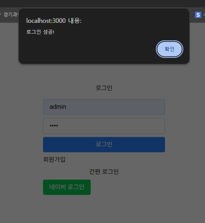

# Auth.js로 로그인 구현 공부

Next.js + Auth.js를 이용해서 커스텀 로그인과 네이버 로그인 기능을 구현해봤습니다.

## 이미지

아이디 비밀번호로 로그인 하거나 네이버 로그인을 선택해서 로그인 가능합니다.

로그인 성공 시 alert 메시지를 보여주며 실패 시 실패했다는 alert 메시지를 보여줍니다.

로그인 성공 시 admin 페이지로 이동하며 세션에 저장된 정보를 보여줍니다.

## 기술 스택

- Framework: Next.js (App Router)
- Language: TypeScript
- Styling: Tailwind 
- Library: Auth.js